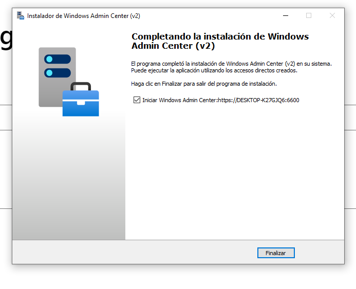
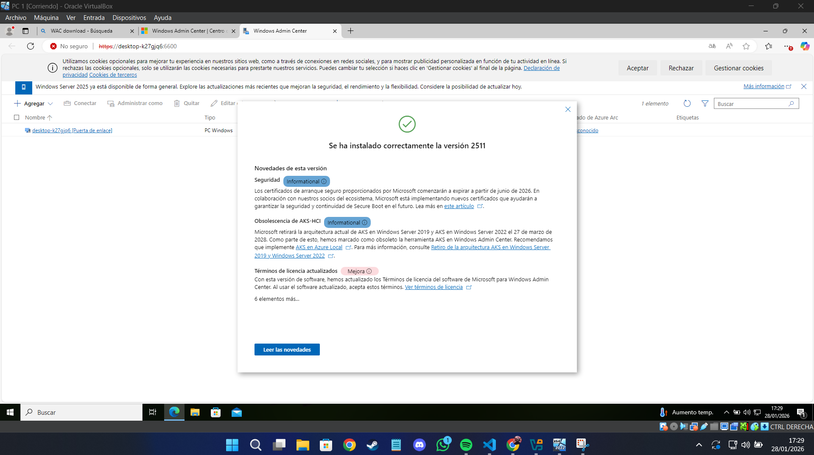
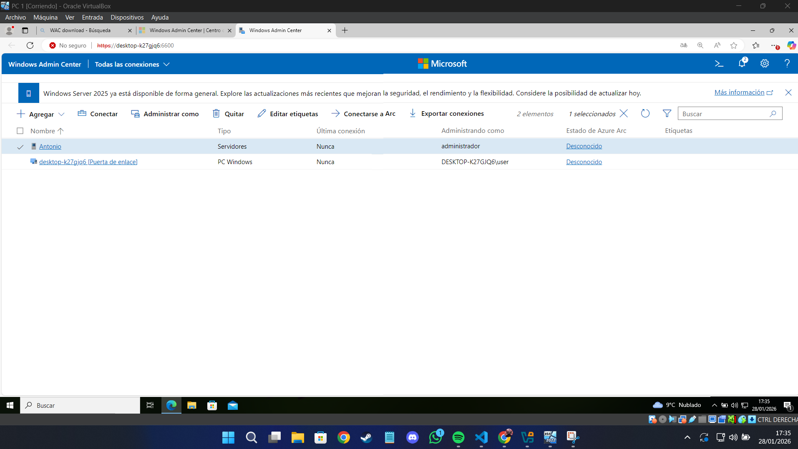
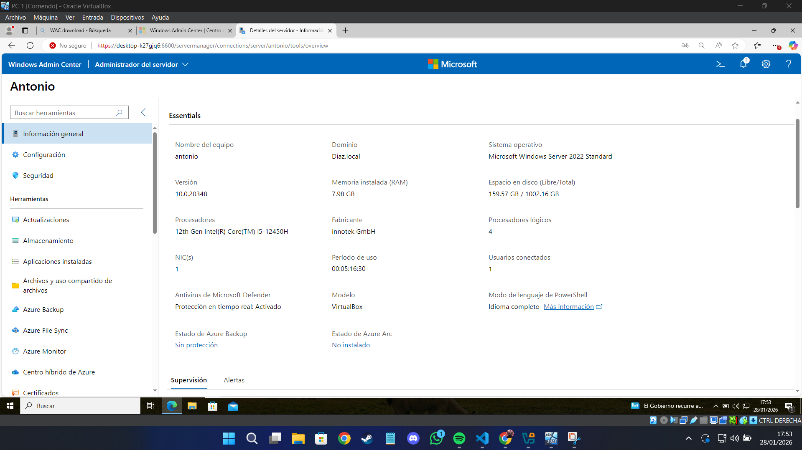
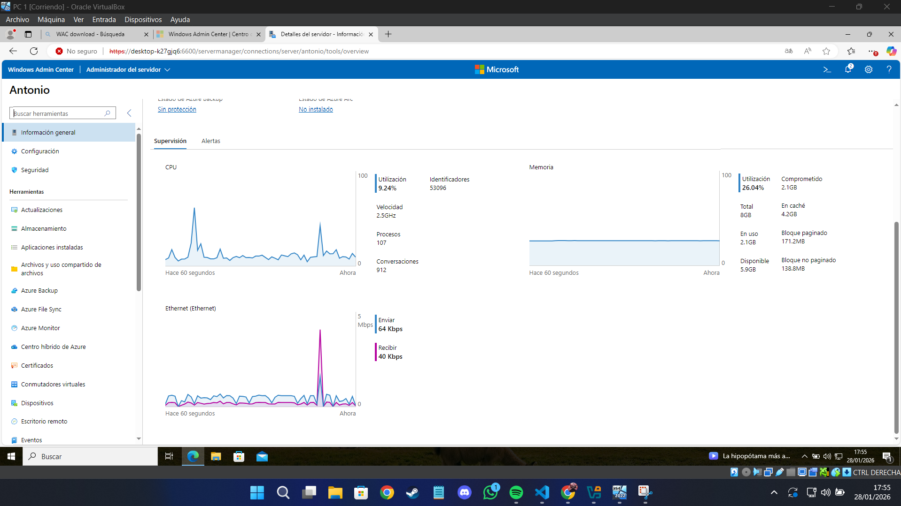
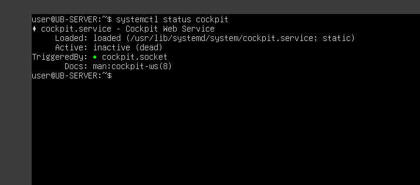
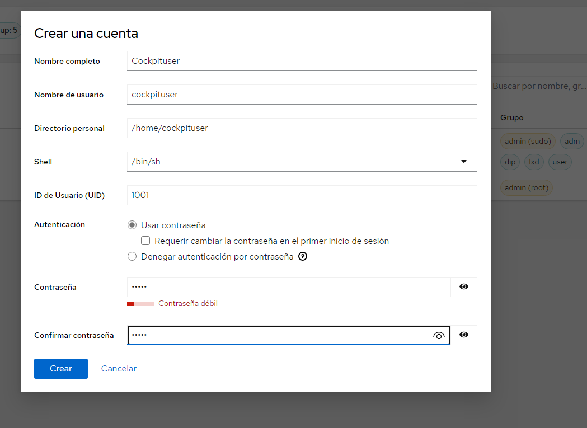
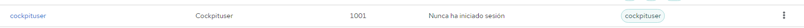
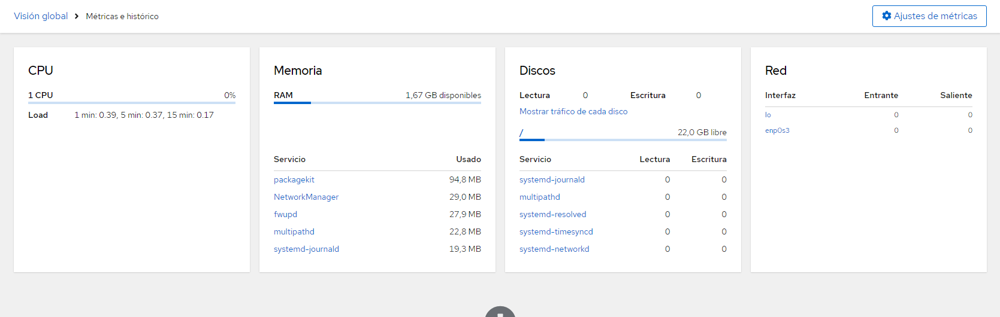

# ASO_UT4_PRACTICA1_WAC_COCKPIT
## Antonio Díaz González

### PARTE 1: WINDOWS ADMIN CENTER

Lo primero que tenemos que hacer es, desde una maquina Windows 11 es descargar e instalar "WAC" (Windows Admin Center)

Despues agregamos nuestro Windows Server e inicamos sesión con un usuario del dominio

Para despues poder hacer unas comprobaciones/revisiones

### PARTE 2: COCKPIT 

Lo primero que tenemos que hacer es instalar "cockpit" en nuestro servidor ubuntu. Después, verificaremos su estado.

Ahora nos conectaremos a cockpit mediante un navegador en nuestro windows 11 para así crear desde la consola un usario no root.

Ahora desde la interfaz de cockpit iremos a monitorizar el sistema

## FIN

