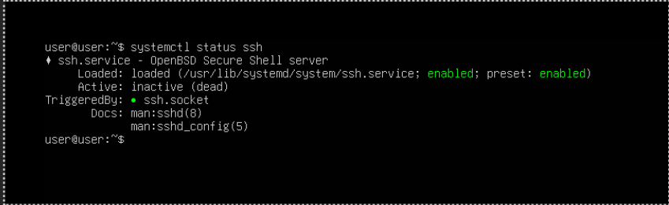
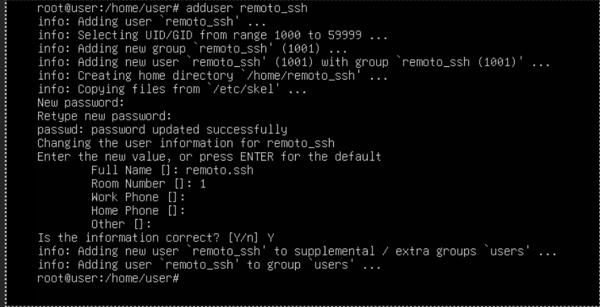
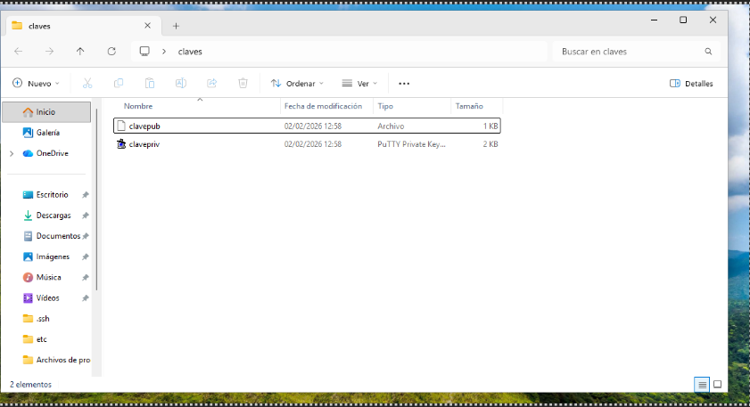
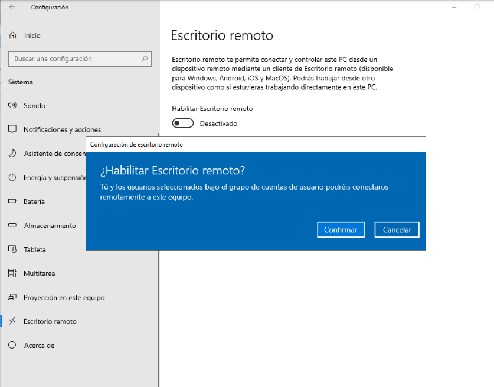
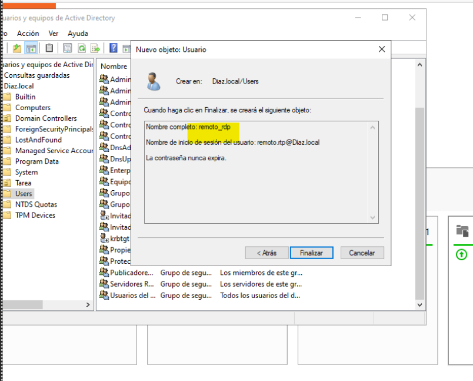
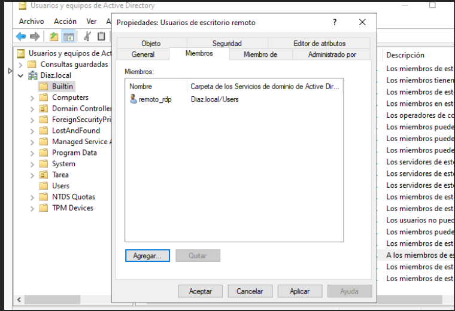
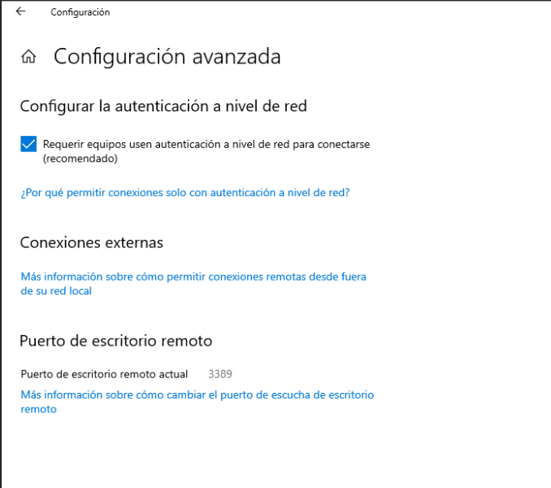

# ASO_UT4_Practica2_Acceso_Remoto
## Antonio Díaz González

### PARTE 1: Acceso remoto seguro por SSH

Primero comprobaremos que SSH está funcionando y crearemos un usuario dedicado simple y llanamente al acceso remoto por SSH

Despues con el programa PuTTY crearemos tanto una clave pública como una privada

### PARTE 2: Administración remota gráfica (RDP)

Para utlizar la función de escritorio remoto lo primero que hay que hacer, como no, es activar la función llendosnos a los ajustes del sistema de nuestro windows server

Despues crearemos un usuario para la conexión llamado "remoto_rdp", metiendolo en el grupo "Usuarios de escritorio remoto.

Habilitaremos la opción de autenticación de red para mas seguridad (NLA)

Y ahora desde nuestro Windows 11 meteremos las credenciales para ingresar en nuestro usuario creado para el control remoto

## FIN
